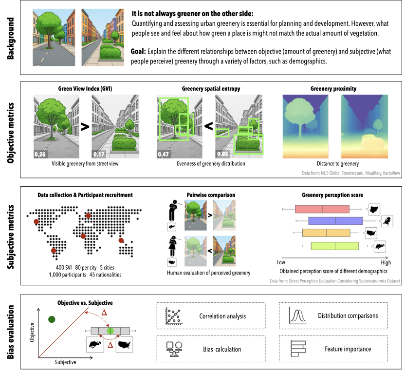

# It is not always greener on the other side: Greenery  perception across demographics and personalities in  multiple cities

This repository is the official implementation of [It is not always greener on the other side: Greenery perception across demographics and personalities in multiple cities](https://arxiv.org/abs/2512.17186).

# Requirements

To install requirements:

```
python install -r requirements.txt
```

# Dataset
This work uses the [SPECS dataset](https://github.com/matqr/specs) (labels and SVI) and the [NUS Global Streetscapes dataset](https://github.com/ualsg/global-streetscapes) (contextual metadata).
Remaining files (depth-related metrics, prediction model, segmentations) are hosted in [huggingface](https://huggingface.co/datasets/matiasqr/greenery-perception/).

```
data
|- depth (depth computations of only greenery mask for all svi, download from huggingface)
|   |- met_depth (absolute depth .npy for each svi)
|   |- rel_depth (relative depth .npy for each svi)
|   |- met_depth_statistics_combined.csv
|   |- rel_depth_statistics_combined.csv
|- global-streetscapes (download contextual data from original repo)
|- labels (download files from original repo)
|   |- final (SPECS survey anwswers)
|   |- processed (trueskill and qscores computed values)
|- segmented_panoptic (segmented and blended outcome for all svi, download from huggingface)
|- svi (raw images within each country's folder and an 'all' folder, download files from original repo)
|   |- metadata.csv (uuid and survey image number mapping for all svi)
|   |- img_paths.csv (path within this repo for all svi)
```

The notebook `0a_gvi-calculations.ipynb` peforms the semantic segmentation for greenery and  computes the GVI values.
Then, the notebook `0b_preprocessing.ipynb` creates different datasets with Q Scores based on all available and different demographic and personality groups.

# Methodology


# Analyses
The notebook `0a_preprocessing.ipynb` creates different datasets with Q Scores based on all available and different demographic and personality groups.
Then, the notebook `0b_gvi-calculations.ipynb` peforms the semantic segmentation for greenery and  computes the GVI values.


## Correlation and  bias evaluation
The file `1_greenery-gvi-location.R` runs a Pearson correlation analysis on images' green perception Q scores and GVI based on the images' and participants' location, i.e., location pairs.

The file `2_green-gvi-scatter-altman.R` generates a Bland-Altman analysis and plot, based on the images' locations and then by location pairs. It also runs a Wilcoxon Signed-Rank between the median of score differenecs (Q score - GVI) and a median of 0.

The file `3a_greenery-beautiful-location.R` runs a cubic correlation analysis on images' green and beautiful perception Q scores based on location pairs.

The file `3b_greenery-lively-location.R` runs a cubic correlation analysis on images' green and lively perception Q scores based on location pairs.

## Greenery distribution

### Spatial entropy
The Jupyter notebook `4a_spatial_entropy_calculation.ipynb` computes the spatial entropy for a range of window sizes and the window size is determnined with a sensitivty plot done by `4b_spatial_entropy_sensitivity.R`.

The file `4c_spatial_entropy_analysis.R` performs Mann-Whitney U statistical tests on spatial entropy values based on most and least perceived green images (Q1 and Q3 quantiles of Q score values).

### Distance
The file `5a_depth_calculations.ipynb` computes the mean depth distribution across images grouped by based on most and lest perceived green images (Q1 and Q3 quantiles of Q score values).
Then, the file `5b_depth_analysis.R` performs Mann-Whitney U statistical tests between the Q1 and Q3 Q scores distributions on images grouped on location pairs.
Complementary, the file `5c_qscore_by_depth_analysis.R` performs the same tests between the Q1 and Q3 of their vegetation proximity in meters (median of depth values).

## Demographic differences
The file `6_demographic_diff.R` highlights a comparison of different perception of the same urban scene by participants from different locations.

## Perception modeling
The Jupyter notebook `7_perception-modeling.ipynb` trains and evaluations a Random Forest model based on different participants' metadata (demographic and personalities) and image-based features, and performs a conditional feature permutation evaluation.
The file `7_perception-modeling_plots.R` generates the respective plots based on the permutation analysis.

## Auxiliary files
The following files were used for complementary computations and analyses
- `9a_green_thresholding.ipynb` produces green masks based on green pixel values and `9b_color-thresholding-vs-semantic-gvi.R` compares the GVI values based on pixel-based green masks and semantic segmentation masks.
- `9c_trueskill_vs_qscore.R` compares the Trueskill scores and Q scores for all images.
- `9d_shanon_entropy_analysis.R` computes the Shanon entropy values for all images.

# Paper / Attribution / Citation
If you use our dataset or work, please cite the paper:

BibTeX:
```
@article{TODO
}
```

# Postprint
Besides the published paper, a free version (postprint / author-accepted manuscript) can be downloaded [here](https://arxiv.org/abs/2512.17186).
